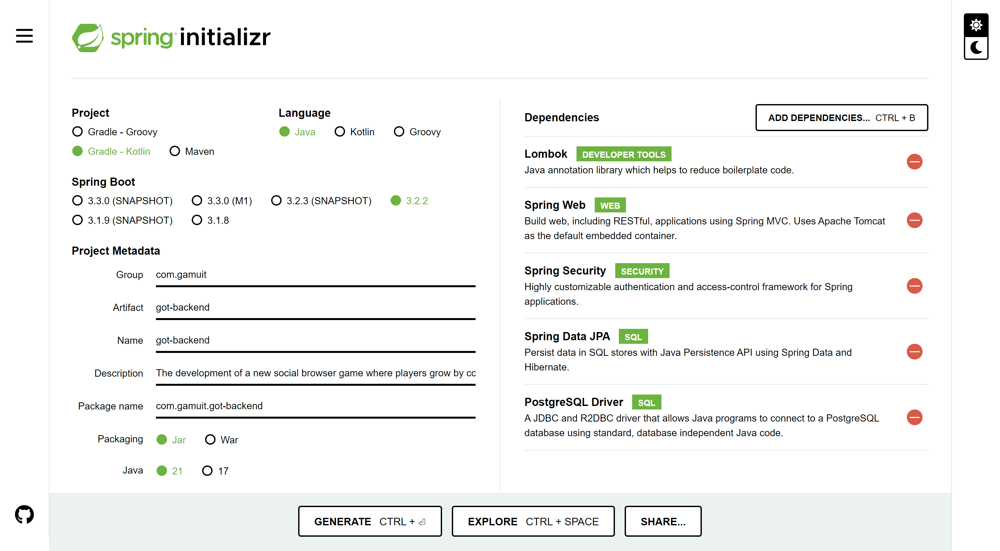

# Project Setup Documentation

**Game of Trust**  
_By GamuIT Development  
(Developers: Alexander, Arjan, Devon, Janne)_

[Product Goal](product-goal)

[Product Backlog](product-backlog)

[Project Proposal](project-proposal)

[Errors and Notifications](errors-notifications)

## Project Setup

add more

## IDE setup

VSCode plugins:
Code Spell Checker

## Ubiquitous Language Definition

| Word/phrase | Definition                                                     |
| :---------: | -------------------------------------------------------------- |
|    User     | An anonymous person, a person not yet registered or logged in. |
|   Player    | A registered and logged-in user.                               |
|  Add more   | Add more                                                       |

## Spring initializr setup:

## Frontend wireframes

### Home page
